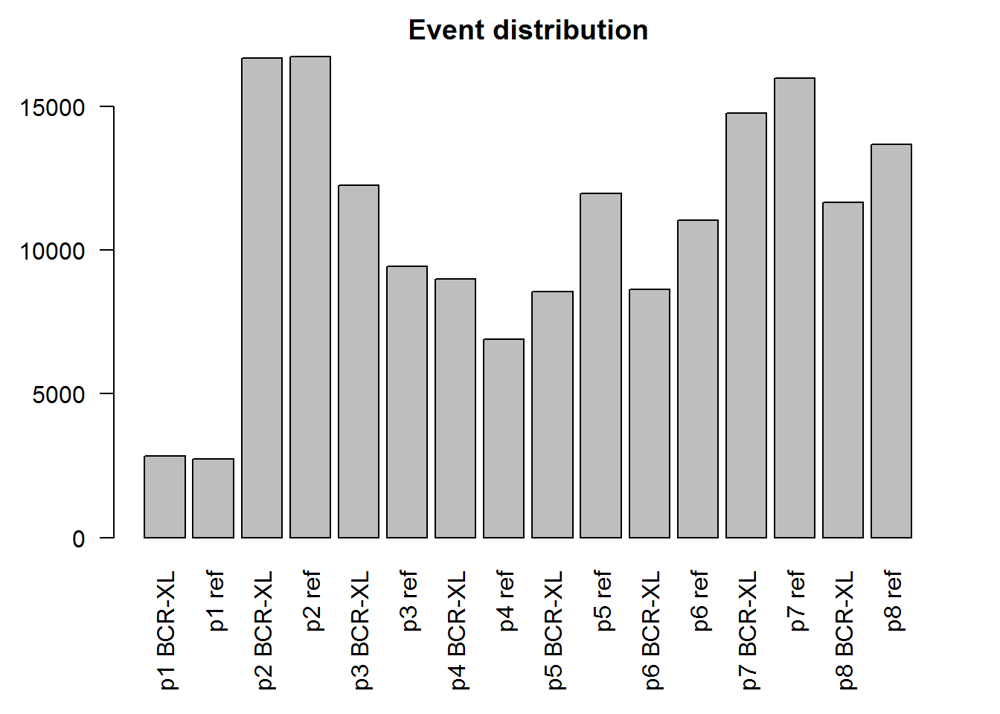
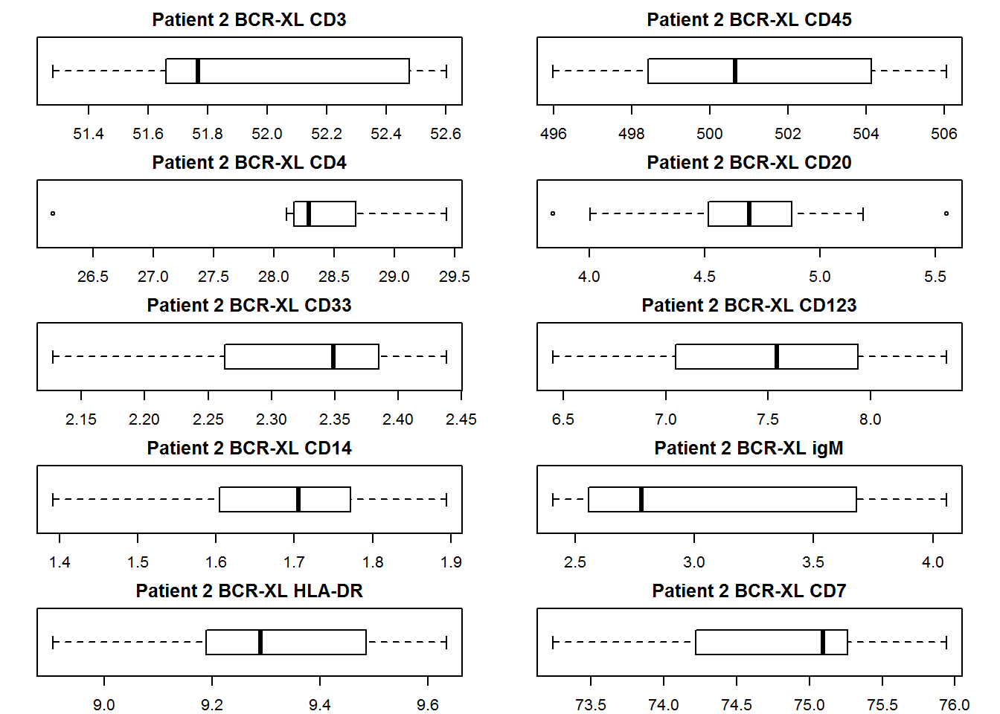
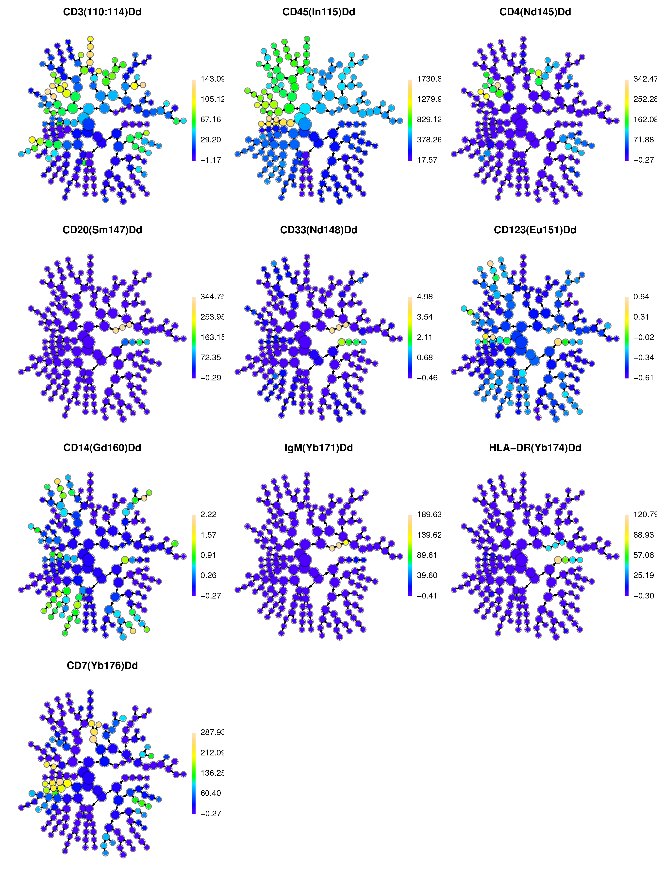
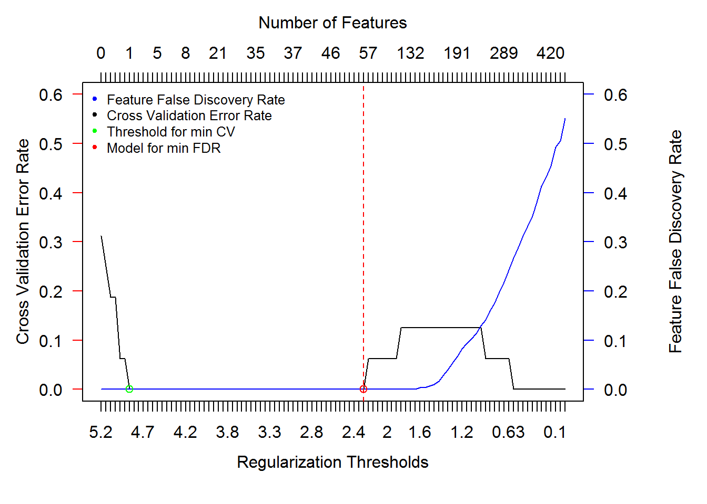
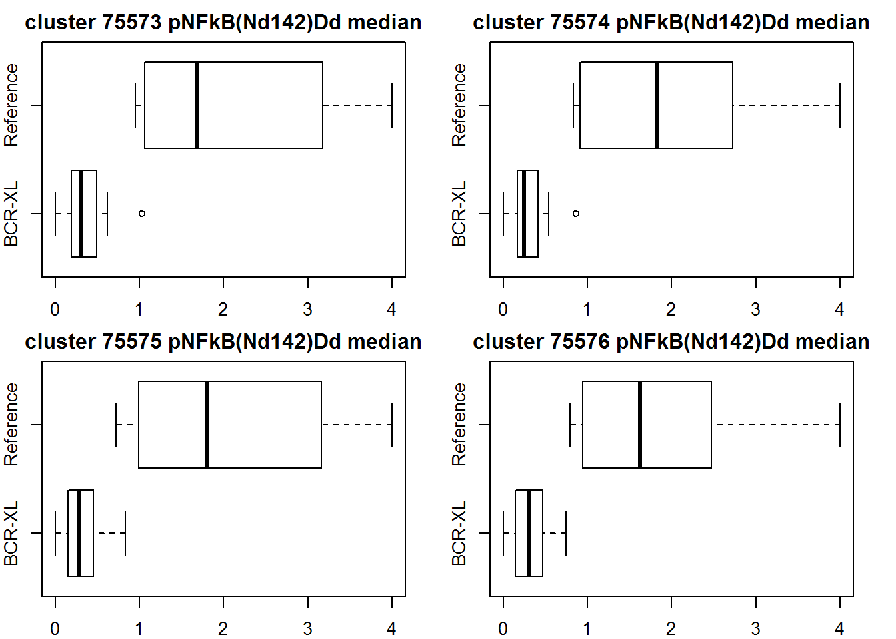
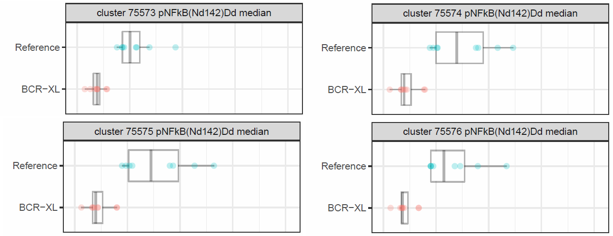
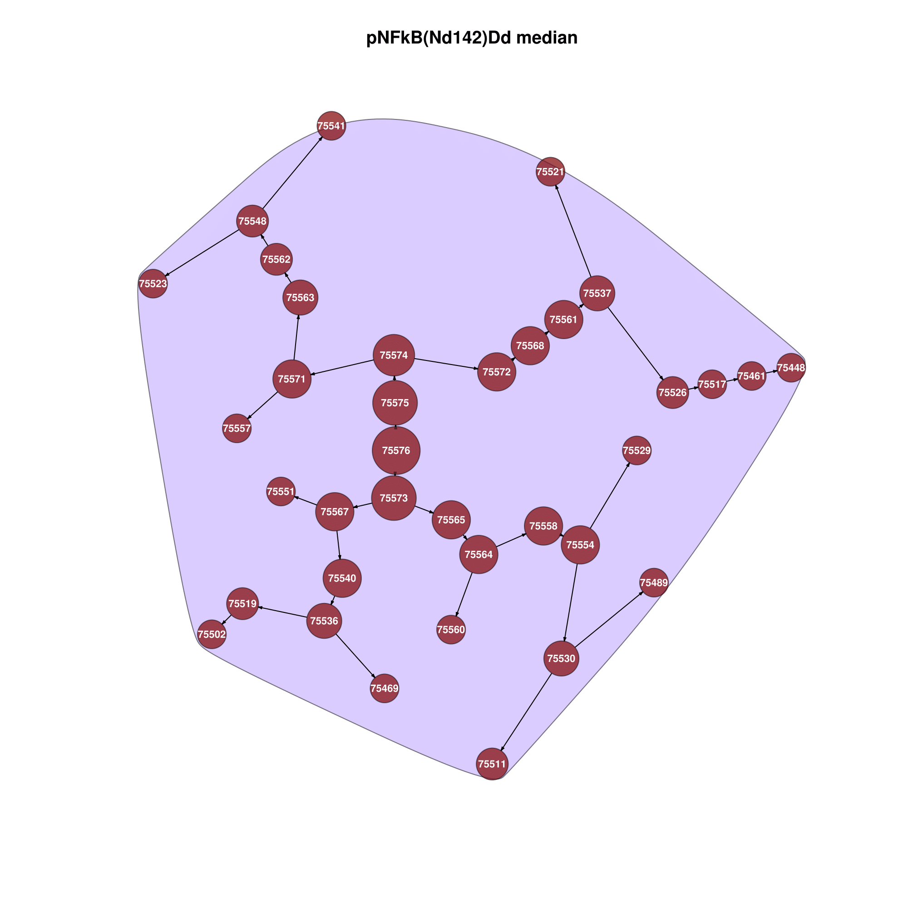

<br\><br\><br/>
<br\><br\><br/>
```{r "setup", echo=FALSE, include=FALSE}
knitr::opts_knit$set(root.dir = "C:/Users/user/Downloads/STA426Project/")  # with something else than `getwd()`
library(captioner)
library(citrus)
library(knitr)
library(png)

#this loads environment
load(file="C:/Users/user/Downloads/STA426Project/submitme.RData")

figs <- captioner(prefix="Figure")
tbls <- captioner(prefix="Table")

figs("eventcount_files","Total number of events per file")
capeventcount = figs("eventcount_files")

figs("box","The same data is plotted here as in Table 1. We picked a random patient and looked at the boxplots for the mean marker intensity of 100 trials.", display=FALSE)
capbox = figs("box")

figs("test","add some text here")
test = figs("test")

figs("hiplot","add some text here")
hiplot = figs("hiplot")

figs("img","Estimated Model Error Rate and feature FDRs as a function of model regularization threshold. The threshold at at which final model is constrained is shown by dotted red line.")
capimg = figs("img")

#figs("img2","Estimated Model Error Rate without nFolds")
#capimg2 = figs("img2")

figs("box1","Four features chosen by the FDR threshold that we estimate to be the four most significant features. Applied was a Kolmogorov–Smirnov test to determien the most unlike distributions")
capbox1 = figs("box1")

#figs("box2","Four features chosen by the FDR threshold from median features that we estimat to be the four most significant features. Applied was a Kolmogorov–Smirnov test to determien the most unlike distributions")
#capbox2 = figs("box2")

tbls("dataspread","Each files was downsampled with 5000 samples for 1000 times. Each time the mean marker intensity for the extracellular markers was calculated. Here we show the mean of 1000 means ± s.d.. Patient 1 has s.d. zero because the files contain less than 5000 events.")
capdataspread = tbls("dataspread")
```
##Introduction
Single cell measurements have a clear advantage over whole population measurements. In whole population measurements we measure the average value of a parameter over the total population in the sample. To answer questions that involve the study of specific subpopulation of cells, this is not very helpful. With single cell measurements, we are able to get values for each cell separately. Given single cell data from a sample, we should be able to stratify the cells into its subpopulation and make some prediction towards a disease state, for example. 
The most common method to obtain single cell measurements is flow cytometry. For a long time fluorescent flow cytometry was very popular. With this method, in addition to physical properties such as shape though light scattering, one can measure signal strength of a fluorescent marker on and in the cell. This technique is limited by the spectral overlap, i.e. the overlap of the wavelength of the differently colored fluorescent used. This makes it very hard to distinguish a large number of parameters. In resent time flow cytometry has been coupled with mass spectrometry to allow the measurements of >40 inner and outer cellular parameters at the same time. Very briefly, in this method samples are incubated with antibodies carrying rare metals and are then vaporized in a time-of-flight mass spectrometer. The mass of the rare metals and their abundance is measured and replaces the fluorescent measurement of fluorescent flow cytometry.<br>
Bruggner [@Bruggner2014] has proposed a new automated method to detect stratifying signatures in cellular sub populations. They named their method Citrus and it is available as an R package. Citrus combines unsupervised and supervised learning to select significant features within the data. First, a predefined number of samples is randomly selected from each patient and the data is combined. This data is then clustered using hierarchical clustering. From these clusters, citrus tries to extract relevant features. Features are selected by building and testing models for the values of the mean difference of intensity values of the intra cellular markers. These intra cellular markers are tested against the end-point e.g. healthy / diseased.The model is tested via cross-validation and a subset of features chosen accordingly.
In this project work, we set out to explain the workings of citrus in more detail while following the same real world example that is used in the original paper. We want to reproduce the results presented by Bruggner et al, more specifically, we are curious if we are able to find the same top four features in the data set as presented in Figure 2B of the paper.  

##Data
Bodenmiller [@Bodenmiller2012] created a dataset with a newly proposed mass-tag cellular barcoding (MCB) method. This method allows for very high dimensional data acquired with mass cytometry. More specifically they set out to measure signaling dynamics and cell-to-cell communication in peripheral blood mononuclear cells (PBMC). To this end 12 different experimental conditions were set up and 14 signaling nodes and 10 cell-surface markers were measured at different time points from 0-4h. Here we focus on one of those conditions mainly the cross-linking of the B-cell receptor (BCR)/Fc receptor (FcR). The data consist of 16 samples of eight healthy donors, one reference and one treated sample per patient. 

##Data sampling
The data [@data] was downloaded from cytobank.org. In total 16 .fcs files were downloaded. For each patient there is a different number of events in the FCS files. As Figure 2 shows the number of events ranges from about 3000 in patient 1 to about 17'000 in patient 2. To prevent over representation of any one sample and to reduce computation time Citrus sub samples a user specified number of events per patient and then merges the data before clustering. 
<br />
```{r fig.align='center',fig.cap=capeventcount, echo=FALSE}
par(mar=c(6,4,2,2)) #sets the bottom, left, top and right
barplot(eventcount,main="Event distribution",
        names.arg=c("p1 BCR-XL","p1 ref","p2 BCR-XL","p2 ref","p3 BCR-XL","p3 ref","p4 BCR-XL",
                    "p4 ref","p5 BCR-XL","p5 ref","p6 BCR-XL","p6 ref","p7 BCR-XL","p7 ref",
                    "p8 BCR-XL","p8 ref"),las=2)
```


The function sample() from the R base package is used to select 5000 random data points from each FCS files, if available. As we have tried to reproduce the exact data obtained by Bruggner et al. we found that this is not possible. We suspect this to be the result of sub sampling the date. Each time citrus selects 5000 out of 17'000 events the clustering results are different. Because in hierarchical clustering every data point is seen as a cluster, a significance threshold of 5% was defined. In order words, only clusters containing 5% or more of the total data are seen as significant enough to be considered for further analysis. The original paper represented a clustering containing 31 significant clusters. During our work with citrus and the Bodenmiller data we clustered the data dozens of times and everything from 31 to 37 clusters were obtained, every number multiple times expect 31. We got 31 exactly once. To get an idea how different the sub-samples really are, we decided to sub-sample 5000 data points for each data file 10 times and calculate the mean and standard deviation of the mean of the intensity of the markers. Table 1 below shows the result of this sub-sampling. We sampled 10 times to really get a feeling of range of different types of possible results and not get tricked by the law of large numbers into thinking that there is very low variance. The method proposed by Bruggner et al. uses only one iteration of clustering and feature selection after all. As we can see in Table 1 below the standard deviations of the sample would suggests that few iterations of the clustering process would give a good average representation of the data.   

```{r results='asis',echo=FALSE}
kable(data_analysis, caption = "Table1: Each files was downsampled with 5000 samples for 10 times. Each time the mean marker intensity for the extracellular markers was calculated. Here we show the mean of 10 means ± s.d.. Patient 1 has s.d. zero because the files contain less than 5000 events.",format = "html")
```
<br /><br />
It is interesting to look at box plots of one specific patient. Figure 2 below shows the same data as in Table 1 for patient 2. This box plot reveals that for our 10xsampling there are outliers for CD14 and CD45. If, as proposed in the paper, the clustering and feature selection process would only be iterated once, this could have an impact on the result. In other words, our small test has shown that even in 10 sub-sampling it is possible to have datasets containing outliers what could lead to different results in hierarchical clustering.  
<br /><br />


```{r results='asis',fig.align='center',fig.cap=capbox, echo=FALSE}
par(mfrow=c(5,2))
marker_names = c("CD3","CD45","CD4","CD20","CD33","CD123","CD14","igM","HLA-DR","CD7")

par(mar=c(2,2,2,2))
par(las = 1) # all axis labels horizontal
for(x in 1:10){
  boxplot(as.data.frame(avgintensity_plot[,x]), main = paste("Patient 2 BCR-XL",marker_names[x]),
          horizontal = TRUE)
  }
```

<br /><br />

##Clustering of data by extracellular markers
One popular method for unsupervised learning is clustering. In clustering one can apply different algorithms to detect structure within a given data set and can build features based on cluster membership. Citrus uses Rclusterpp.hclust() also created by Bruggner et al. This function is an implementation of the Agglomerative Hierarchical Clustering algorithm. In hierarchical clustering smaller clusters are merged into larger clusters following a given distance function and linkage method. In Citrus the distance between markers is specified by the Euclidean distance and Wards linkage used as the agglomerative method. Wards methods minimizes the total within cluster variance.  
The Bodenmiller data is clustered by the intensity of the extra cellular markers CD45, CD4, CD20, CD33, CD123, CD14, IgM, HLA-DR, CD7 and CD3. 

After clustering it is interesting to look at the topology of the resulting clustering graphs. Figure 3 below shows a graph of clusters containing at least 1% of the total data. A graph is shown for each extra cellular marker and the clusters are color coded according to the relative intensity of the marker in that cluster. This type of graphs reveals subsets of cells in the data. Interesting is the sub graphs which are prominent for CD20 and CD33 but reappears in half of all the graphs. It can be speculated, that this sub graph represents an important subset of the cells because they appear to have several markers differentialy expressed. Notably this clear substructure was not detected in each clustering. In fact, we had to cluster several times to achieve a nice result like this as is presented in the paper (Figure S12 [@Bruggner2014]). 
<br /><br /><br />


<figure align="middle">
  
  <figcaption>Figure 3. Hierarchical plot of all clusters containing at least 1% of the total data. The relative intensity of the extra cellular markers are color coded and show the existence of sub graphs which correspond to sub populations of cells.</figcaption>
</figure>

<br /><br />

##Compare clustering with different subsamples
Figure 4 illustrate the diversity of results we obtained. These instances of clustering have a significant number of clusters at 5% in a range of 31 to 40. In neither of them did we find a clear sub graph represented over multiple markers.
<br /><br />

<figure >
  
  <figcaption>Figure 4. Hierarchy graphs based on four different sub-sampling of the data. Plotted are clusters with more then 1% of the data. Number of clusters for 5% of the data range from 32 to 40 among these four clusterings. </figcaption>
</figure>
<br /><br />

##Feature Extraction
As in [@Bruggner2014] after clustering the data according to the extra cellular markers features are extracted based on intra cellular markers. The markers selected for feature extraction are: pNFkB(Nd142)Dd, pp38(Nd144)Dd, pStat5(Nd150)Dd, pAkt(Sm152)Dd, pStat1(Eu153)Dd, pSHP2(Sm154)Dd, pZap70(Gd156)Dd, pStat3(Gd158)Dd, pSlp76(Dy164)Dd, pBtk(Er166)Dd, pPlcg2(Er167)Dd, pErk(Er168)Dd, pLat(Er170)Dd and pS6(Yb172)Dd. These are all phosphorylated internal signaling nodes. The hope is that the measured values for these signaling nodes are influenced by the B-cell receptor (BCR)/Fc receptor (FcR) cross linking. There two feature types that can be extracted with citrus, abundance and medians. For the given data Bruggner used the median features. For this the median for each marker is calculated on a per-sample base.

##Model Construction
It is necessary to assign each and every sample to one of two or more stimulation groups (i.e 'Reference' and 'BCR-treated' in this case), when we wish to identify features that differ between these groups. After the calculation of descriptive cluster features, regularized classification models are generated, where the cluster features act as independent variables/regressors of the sample groups. However, only a subset of calculated cluster features are used to obtain the differences between the groups. Thus, model generation uses methods such as nearest shrunken centroid (pamr) and lasso-regularized logistic regression (glmnet). These methods generate a series of models based on highly informative subsets of the provided cluster features (the regressors) which are automatically selected. The number of regressors that are included in any given model are restricted by regularization threshold. But, as it not possible to know which subset of features best stratify the groups, instead  of a single model at a specified threshold, a set of 'i' models are built using a range of 'i' regularization thresholds. Now, to select an optimal model, cross-validation is perfomed and the simplest one that meets the specified constraints is selected.

The nearest shrunken centroid is derived from the standard nearest centroid classifcation. This method computes a standarized centroid for each class. It shrinks the centroids for every class towards the overall centroid for all classes by a factor of 'threshold'. This shrinkage means moving towards zero by the threshold, and setting it equal to zero when and if it hits zero. After this shrinking, the samples are classifed to their nearest centroid, but uses the shrunken class centroids. One obvious advantage has already been mentioned that it automatically selects the samples/clusters/features and also that it makes the classification more accurate. 


##Results Assessment and Selection of a Final Regularization Threshold
The quality of results can be assessed using model error rate plots. A model with small estimated error rate has identified certain subset of cluster features that are strong predictors of sample groups. Building up on this, it means that these subset of features show a behaviour that is novel to that group. Hence, these features are stratifying subset of interest. On the other hand, a model with a high error rate has features that do not differ between sample classes and hence are not useful stratifying features. Thus, interpretation should be done only from models having an acceptable error rate. 

When such models with acceptable error rates have been constructed, a regularization threshold is chosen that will be used to constrain the final model. The final model is constructed from all the sample features. A regularization threshold is chosen that results in the simplest model with acceptable error rate. This model would then have a small but informative subset of features differeing between groups. Accordingly, when it is required to identify all of the features that differ between samples, a threshold should be chosen such that, at this value it prodcues a complex model with acceptable error rate and a feature FDR.

##Interpretation of Results
The final constrained model that is generated based on the regularization thresholds and sample features. The non zero features of this final model are the set of features that best differentiate between the sample. The values of these relevant features for each sample are shown in box plots. Related stratifying subsets that have similar behavior may be identified by highlighting relevant subsets in plots of the clustering hierarchy. The plots of clustering hierarchy can be highlighted to identify stratifying subsets that depict similar behaviour.

##Results
The descriptive cluster features were used to train a nearest shrunken centroid classifier (pamr) of the sample's simulation group (reference or BCR-treated) at a range of regularization thresholds that is automatically computed by citrus. Cross-validation and permutation tests are used to estimate and plot classification error rates and feature false discovery rates of each model respectively. 

In order to determine all features that differed between the different sample groups, error plot produced above was used to identify the smallest regularization threshold that produced a model with acceptable cross validation accuracy and an estimated feature FDR of < 1%. Using this, Citrus constrained the final classificaiton model from all sample. From the original set of 504 cluster features, a subset of 51 was chosen as which differed between the two simulation conditions. The cutoff line is drawn at the point where the cross validation mean and feature false discovery rate is 0. This line intersects the regularization threshold axis at 2.24805 and the Number of features axis at 51

##Model Error Rate

```{r fig.align='center',fig.cap=capimg, echo=FALSE}
par(mar=c(5,4,4,6)+0.1)

plot(citrus.regressionResult$thresholdCVRates$cvm,
     pch=c(1,NA,NA,NA,NA,NA,NA),
     axes=FALSE,
     ylim = c(0,0.6), 
     xlab="",ylab="",
     type='l', col="black", bg="black")
axis(2, col="red", las = 1)
mtext("Cross Validation Error Rate",side=2,line=2.5)
box()

par(new=TRUE)

plot(citrus.regressionResult$thresholdCVRates$fdr,
     pch=c(1,NA,NA,NA,NA,NA,NA),
     axes=FALSE, 
     ylim = c(0,0.6), 
     xlab="",ylab="",
     type='l',col="blue")
axis(4, col="blue", las = 1)
mtext("Feature False Discovery Rate",side=4,line=4)
box()

par(new=TRUE)

axis(1, at=c(1:100),labels=signif(citrus.regressionResult$thresholdCVRates$threshold,2))
mtext("Regularization Thresholds", side=1,line=2.5)

axis(3, at=c(1:100),labels=citrus.regressionResult$finalModel$model$nonzero)
mtext("Number of Features", side=3,line=2.5)

par(new=TRUE)
points(57, citrus.regressionResult$thresholdCVRates$fdr[57],col="red")


for(i in 1:100){
  if(citrus.regressionResult$thresholdCVRates$cvm[i] == 0.0){
    par(new=TRUE)
    points(i, citrus.regressionResult$thresholdCVRates$cvm[i],col="green")
    break
  }
}

par(new=TRUE)
abline(v=citrus.regressionResult$cvMinima$cv.fdr.constrained.index, col="red", lty=2)

legend("topleft", 
        inset = c(0,0), 
        cex = 0.8, 
        bty = "n", 
        legend = c("Feature False Discovery Rate", "Cross Validation Error Rate","Threshold for min CV",
                   "Model for min FDR"), 
        text.col = c("black"),
        col = c("blue", "black","green","red"), 
        pch = c(20,20,20,20))
```


##Top Features
As discussed in the introduction, the goal was to reproduce the four top features that are shown in Figure 2A [@Bruggner2014]. The citrus endpoint regression function put out a list of features for the two thresholds that are available. It is not clear in what order this list it, nor is it documented anywhere. It is clear though that this list is not ordered in how significant a feature is. In the supplementary material it mentioned in a figure caption depicting top features, that feature are ordered by model weight. Unfortunately we were not able to determine this model weights. As an alternative in order to estimate the for top features we here apply a two sample Kolmogorov–Smirnov test. Unfortunately these are not the features that we hoped to see. In fact, the features that we wanted are not even in the list of all features selected under the model with the FDR threshold.

#Data Transformation
Taking a closer look median feature values, it can be observed that it contains both positive and negative values distributed over a very wide range. Using these values to create a boxplot will yield graphs that have varied scales. Such graphs are not useful when comparison need to be made. For this purpose, it was necessary to transform/normalize the data. Here, the technique of min-max normalization is used and the data values of the medain features are scaled between 0 and 4. The general formula for min-max normalization between [a,b] is: 

                                  (b - a)*(x - min(x))
                                 --------------------   + a
                                    max(x) - min(x)

Here, x goes through all the 504 columns of median Features, and thus the data is normalized to obtain more informative plots.  

```{r echo=FALSE}
medianFeatures_trans <- matrix(nrow = 16, ncol = 504)
for(i in 1:504){
  m <- min(citrus.foldFeatureSet$allFeatures[,i])
  maxi <- max(citrus.foldFeatureSet$allFeatures[,i])
  for(j in 1:16){
          medianFeatures_trans[j,i] <- 4*((citrus.foldFeatureSet$allFeatures[j,i] - m)/(maxi - m))
      }
}

rownames(medianFeatures_trans) <- rownames(citrus.foldFeatureSet$allFeatures)
colnames(medianFeatures_trans) <- colnames(citrus.foldFeatureSet$allFeatures)
```

#BoxPlots
```{r fig.align='center',fig.cap=capbox1, echo=FALSE}
#Box plot for the first 4 features.
list_fea <- citrus.regressionResult$differentialFeatures$cv.fdr.constrained$features

p_result = vector(mode="numeric", length =length(list_fea))
#to determine the order of features, i.e. which is the best, we apply a t test to determine the p value for distributions drawn from the same sample. with this we hope to say something about how good the distributions are seperated 
for(i in 1:length(list_fea)){
  p_result[i] = ks.test(medianFeatures_trans[1:8,list_fea[i]],
                        medianFeatures_trans[9:16,list_fea[i]])[2]
}
top4 = vector(mode="numeric", length=4)
temp = 0
#some weird way to find 4 top features
for(j in 1:4){
  #fidn max in p_result, save it, set to 0, find next
  for(i in 1:length(list_fea)){
    if(p_result[[i]] > temp)
      top4[j] = i
      temp = p_result[i]  
  }
  p_result[top4[j]] = 0
}
par(mar=c(2,2,2,2))
par(mfrow=c(2,2))

for(i in top4){
  boxplot(medianFeatures_trans[1:8,list_fea[i]],medianFeatures_trans[9:16,list_fea[i]],
          horizontal = TRUE, names=c('BCR-XL','Reference'),main=colnames(medianFeatures_trans)[i])
}
```


<br /><br />
<figure >
  
  <figcaption>Figure 7. Box plots for the Top 4 features obtained after applying KS test. Derived from Citrus </figcaption>
</figure>
<br /><br />

Figure 8 illustrates the hierarchy graph in which all the clusters (highlighted) contain the pNFkB(Nd142)Dd median. It can be seen that the clusters 75573, 75574, 75575 and 75576 are the center of this hierarchical graph. These are the same clusters which were identified as having Top Features through the KS test. 
<br /><br />
<figure >
  
  <figcaption>Figure 8. Hierarchy Graph showing all the clusters that contain pNFkB(Nd142)Dd median. Derived from Citrus </figcaption>
</figure>
<br /><br />


##Conclusion
We were not able to reproduce the paper, as we set out to do. It is actually not even possible to exactly reproduce it due to the sub sampling as we have shown. Further more, depending on the sub sampling, the regression model can or cannot reach cross validation error rate of zero. In many cases the error rate would drop to zero only after the FDR rate started to rise. Citrus will then automatically select the threshold where the cross validation error rate is zero, while the FDR is already up 20% and in total 90%+ of all features are selected. What has been published is a very nice and clean instance, that we were not able to reproduce. And we tried.
Many important pieces of information are not given in the paper nor the supplementary material. It is not clear as to why clusters are based on extra cellular and features on intra cellular markers. It is not exactly clear how features have been calculated for the publications. The authors claim to have a total of 465 features after taking the mean of each marker for each cluster. With 31 clusters and 14 markers that would be 434 features. Our features where always expected number. Further it is not clear how the top feature are selected. 
The package citrus itself is very poorly documented. There is almost no explanation on the functions available and we were not able to access source code itself. We were able to read at least part of the source code on Github which helped us to understand what the different functions do. Citrus comes with a GUI. When one executes the GUI, a different but very similar result to the one published is obtained. It even, most of the times, finds that pS6 median values in a limited number of clusters are the features containing the most amount of information regarding stratification of sub populations. Even though we tried to take citrus apart to fully understand what it does, we were not able to find the difference between what the GUI executes and what we do in R directly. Hence this different result. Funnily enough though, we were able to select a subset of features that citrus deemed to be predictive for stratification. The pNF-kB marker that was found to be a differential feature in several clusters was also found to be significant by the original publication. However, the paper also concluded that pNF-kB is an experimental artifact introduced by the multiplexing protocols. 
Despite the apparent failure of this project it nevertheless teached us, again, that we can not relay on publications to be perfect. Once must always assume that what is published is the best possible way that something could have turned out and that there are many sub optimal solutions to the specific problem at hand.  

# Appendix
## R Code
### Setup
```{r echo=FALSE, include=FALSE, eval=FALSE}
knitr::opts_knit$set(root.dir = "C:/Users/user/Downloads/STA426Project/")  # with something else than `getwd()`
library(captioner)
library(citrus)
library(knitr)
library(png)

#this loads environment
load(file="C:/Users/user/Downloads/STA426Project/submitme.RData")

figs <- captioner(prefix="Figure")
tbls <- captioner(prefix="Table")

figs("eventcount_files","Total number of events per file")
capeventcount = figs("eventcount_files")

figs("box","The same data is plotted here as in Table 1. We picked a random patient and looked at the boxplots for the mean marker intensity of 100 trials.", display=FALSE)
capbox = figs("box")

figs("test","add some text here")
test = figs("test")
figs("test1","add some text here")
test1 = figs("test1")

figs("hiplot","add some text here")
hiplot = figs("hiplot")

figs("img","add camption here")
capimg = figs("img")

figs("box1","Four features chosen by the FDR threshold that we estimat to be the four most significant features. Applyed was a Kolmogorov–Smirnov test to determien the most unlike distributions")
capbox1 = figs("box1")


tbls("dataspread","Each files was downsampled with 5000 samples for 1000 times. Each time the mean marker intensity for the extracellular markers was calculated. Here we show the mean of 1000 means ± s.d.. Patient 1 has s.d. zero because the files contain less than 5000 events.")
capdataspread = tbls("dataspread")
```

### Loading of data
```{r eval=FALSE}
dataDirectory = "C:/Users/user/Downloads/STA426Project/data/"
#all the fcs files are loaded
fileList = data.frame(defaultCondition=
                        c("PBMC8_30min_patient1_BCR-XL.fcs","PBMC8_30min_patient2_BCR-XL.fcs",
                          "PBMC8_30min_patient3_BCR-XL.fcs","PBMC8_30min_patient4_BCR-XL.fcs",
                          "PBMC8_30min_patient5_BCR-XL.fcs","PBMC8_30min_patient6_BCR-XL.fcs",
                          "PBMC8_30min_patient7_BCR-XL.fcs","PBMC8_30min_patient8_BCR-XL.fcs",
                        "PBMC8_30min_patient1_Reference.fcs","PBMC8_30min_patient2_Reference.fcs",
                        "PBMC8_30min_patient3_Reference.fcs","PBMC8_30min_patient4_Reference.fcs",
                        "PBMC8_30min_patient5_Reference.fcs","PBMC8_30min_patient6_Reference.fcs",
                        "PBMC8_30min_patient7_Reference.fcs","PBMC8_30min_patient8_Reference.fcs"))
```

### Histogram Figure 1
```{r fig.align='center',fig.cap=capeventcount, eval=FALSE}
eventcount = vector(mode="integer", length=16)
i = 1
#loop each file and count events
for(f in files){
  fcsfile = citrus.readFCS(file.path(dataDirectory,f))
  eventcount[i] = dim(fcsfile)[1]
  i = i +1
  
#sets the bottom, left, top and right
par(mar=c(6,4,2,2)) 
barplot(eventcount,main="Event distribution", 
  names.arg=c("p1 BCR-XL","p1 ref","p2 BCR-XL","p2 ref","p3 BCR-XL","p3 ref","p4 BCR-XL","p4 ref","p5 BCR-XL","p5 ref",
              "p6 BCR-XL","p6 ref","p7 BCR-XL","p7 ref","p8 BCR-XL","p8 ref"),las=2)
}
```

### Data analysis for Figure 2 and Table 1
```{r eval=FALSE,echo=FALSE}

marker = c(3, 4, 9, 11, 12, 14, 21, 29, 31, 33)
marker_names = c("CD3","CD45","CD4","CD20","CD33","CD123","CD14","igM","HLA-DR","CD7")

data_analysis = matrix(data=NA, nrow=16, ncol=10)
colnames(data_analysis) = maker_names
rownames(data_analysis) = c("p1 BCR-XL","p1 Ref","p2 BCR-XL","p2 Ref","p3 BCR-XL","p3 Ref","p4 BCR-XL","p4 Ref",
                            "p5 BCR-XL","p5 Ref","p6 BCR-XL","p6 Ref","p7 BCR-XL","p7 Ref","p8 BCR-XL","p8 Ref")

avgintensity = matrix(data=NA, nrow=10, ncol=10)
colnames(avgintensity) = maker_names

avgintensity_plot = matrix(data=NA, nrow=10, ncol=10)
colnames(avgintensity_plot) = maker_names

k = 1
for(j in 1:8){
  #loop all bcr / ref, load files
    for(each in c("_BCR-XL.fcs","_Reference.fcs")){
      fcsfile = citrus.readFCS(file.path(dataDirectory,paste0("PBMC8_30min_patient",j,each)))
      #subsamples 10 times
      for(i in 1:10){
        #if not patient 1, sample 5k, p1 has only ca. 3k samples
        if(j != 1){
          sample_fcsfile = fcsfile[sort(sample(1:nrow(fcsfile),5000)),] #1:numberofrowsin(fcsfile)
        }else{
          sample_fcsfile = fcsfile #1:numberofrowsin(fcsfile)
        }
        #loop each marker andstore mean
        for(h in 1:10){
          #avgintensity is 10x10 i.e. 10 subsamples with each 10 means for 10 markers
          avgintensity[i,h] = mean(sample_fcsfile@exprs[,marker[h]])
        }
      }
       if(j == 2 && each == "_BCR-XL.fcs"){
         avgintensity_plot = avgintensity
     }
      for(p in 1:10){
       data_analysis[k,p] = paste0(signif(mean(avgintensity[,p]), digits = 2),
                                   "±",signif(sd(avgintensity[,p]), digits = 2))
      }
       k = k +1
      }
}
```

### Plot Figure 2
```{r results='asis',fig.align='center',fig.cap=capbox, eval=FALSE}
par(mfrow=c(5,2))
par(mar=c(2,2,2,2))
par(las = 1) # all axis labels horizontal
for(x in 1:10){
  boxplot(as.data.frame(avgintensity_plot[,x]), main = paste("Patient 2 BCR-XL",marker_names[x]), horizontal = TRUE)
         }
```

### Plot Table 1
```{r results='asis',eval=FALSE}

kable(data_analysis, caption = "Table1: Each files was downsampled with 5000 samples for 1000 times. Each time the mean marker intensity for the extracellular markers was calculated. Here we show the mean of 1000 means ± s.d.. Patient 1 has s.d. zero because the files contain less than 5000 events.",format = "html")
```

### Clustering
```{r eval=FALSE}
#data is clustered according to extracellular markers
clusteringColumns = c("CD3(110:114)Dd","CD45(In115)Dd","CD4(Nd145)Dd","CD20(Sm147)Dd","CD33(Nd148)Dd","CD123(Eu151)Dd",
                      "CD14(Gd160)Dd","IgM(Yb171)Dd","HLA-DR(Yb174)Dd","CD7(Yb176)Dd")

#vector of endpoints for regression
labels = as.factor(c("BCR-XL","BCR-XL","BCR-XL","BCR-XL","BCR-XL","BCR-XL","BCR-XL","BCR-XL",
                     "Reference","Reference","Reference","Reference","Reference","Reference","Reference","Reference"))

#data is loaded, sampled and combined
citrus.combinedFCSSet = citrus.readFCSSet(dataDirectory,fileList, fileSampleSize = 5000)

#clustering of folds of sampled data
citrus.foldClustering = citrus.clusterAndMapFolds(citrus.combinedFCSSet,clusteringColumns,labels,nFolds=1)
```

###Hierarchygraphs
```{r eval=FALSE}
citrus.clustering = citrus.cluster(citrus.combinedFCSSet,clusteringColumns,clusteringType = "hierarchical")

#graphs are done with clusters containing >1% of data
largeEnoughClusters1= citrus.selectClusters.minimumClusterSize(citrus.clustering,
                                                               minimumClusterSizePercent=0.01)

largeEnoughClusters5= citrus.selectClusters.minimumClusterSize(citrus.clustering,
                                                               minimumClusterSizePercent=0.05)

hierarchyGraph = citrus.createHierarchyGraph(citrus.clustering,selectedClusters=largeEnoughClusters1)

clusterMedians = t(sapply(largeEnoughClusters1,citrus:::.getClusterMedians,
                          clusterAssignments=citrus.clustering$clusterMembership,
                          data=citrus.combinedFCSSet$data,
                          clusterCols=clusteringColumns))

rownames(clusterMedians) = largeEnoughClusters1
colnames(clusterMedians) = clusteringColumns

citrus.plotClusteringHierarchy(outputFile="outputdirectory",clusterColors=clusterMedians,
                               graph=hierarchyGraph$graph,
                               layout=hierarchyGraph$layout,
                               plotSize=15, 
                               theme = 'white',singlePDF=T,plotClusterIDs=F,scale=1)
```

###Feature extraction
```{r eval=FALSE}

#the per-sample medians for the following markers are calculated as features
medianColumns=c("pNFkB(Nd142)Dd","pp38(Nd144)Dd","pStat5(Nd150)Dd","pAkt(Sm152)Dd","pStat1(Eu153)Dd","pSHP2(Sm154)Dd",
                "pZap70(Gd156)Dd","pStat3(Gd158)Dd","pSlp76(Dy164)Dd","pBtk(Er166)Dd","pPlcg2(Er167)Dd","pErk(Er168)Dd",
                "pLat(Er170)Dd","pS6(Yb172)Dd")

#features are calculated on minClustersize >5%, resulting in clusternumber*14 features
citrus.foldFeatureSet = citrus.calculateFoldFeatureSet(citrus.foldClustering=citrus.foldClustering,citrus.combinedFCSSet=citrus.combinedFCSSet,featureType = "medians",medianColumns=medianColumns,minimumClusterSizePercent = 0.05)
```

###Endpoint Regression
```{r eval=FALSE}
#endpoint Regression with the goal to classifiy. labels contains endpoints
citrus.regressionResult = citrus.endpointRegress(modelType="pamr",citrus.foldFeatureSet,labels,family="classification")
```

###Figure 5
```{r eval=FALSE, fig.align='center',fig.cap=capimg}
par(mar=c(5,4,4,6)+0.1)

plot(citrus.regressionResult$thresholdCVRates$cvm,
     pch=c(1,NA,NA,NA,NA,NA,NA),
     axes=FALSE,
     ylim = c(0,0.6), 
     xlab="",ylab="",
     type='l', col="black", bg="black")
axis(2, col="red", las = 1)
mtext("Cross Validation Error Rate",side=2,line=2.5)
box()

par(new=TRUE)

plot(citrus.regressionResult$thresholdCVRates$fdr,
     pch=c(1,NA,NA,NA,NA,NA,NA),
     axes=FALSE, 
     ylim = c(0,0.6), 
     xlab="",ylab="",
     type='l',col="blue")
axis(4, col="blue", las = 1)
mtext("Feature False Discovery Rate",side=4,line=4)
box()

par(new=TRUE)

axis(1, at=c(1:100),labels=signif(citrus.regressionResult$thresholdCVRates$threshold,2))
mtext("Regularization Thresholds", side=1,line=2.5)

axis(3, at=c(1:100),labels=citrus.regressionResult$finalModel$model$nonzero)
mtext("Number of Features", side=3,line=2.5)

for(i in 1:100){
  if(citrus.regressionResult$thresholdCVRates$fdr[i] != 0){
    par(new=TRUE)
    print("test")
    points(i, citrus.regressionResult$thresholdCVRates$fdr[i],col="red")
    break
  }
}
for(i in 1:100){
  if(citrus.regressionResult$thresholdCVRates$cvm[i] == 0.0625){
    par(new=TRUE)
    points(i, citrus.regressionResult$thresholdCVRates$cvm[i],col="green")
    break
  }
}
legend("topleft", 
        inset = c(0,0), 
        cex = 0.8, 
        bty = "n", 
        legend = c("Feature False Discovery Rate", "Cross Validation Error Rate","Threshold for min CV","Model for min FDR"), 
        text.col = c("black"),
        col = c("blue", "black","green","red"), 
        pch = c(20,20,20,20))
```

###Figure 6
```{r eval=FALSE, fig.align='center',fig.cap=capbox1}
#Box plot for the first 4 features.
list_fea <- citrus.regressionResult$differentialFeatures$cv.fdr.constrained$features

p_result = vector(mode="numeric", length =length(list_fea))
#to determine the order of features, i.e. which is the best, we apply a t test to determine the p value for distributions drawn from the same sample. with this we hope to say something about how good the distributions are seperated 
for(i in 1:length(list_fea)){
  p_result[i] = ks.test(citrus.foldFeatureSet$allFeatures[1:8,list_fea[i]],citrus.foldFeatureSet$allFeatures[9:16,list_fea[i]])[2]
}
top4 = vector(mode="numeric", length=4)
temp = 0
#some weird way to find 4 top features
for(j in 1:4){
  #fidn max in p_result, save it, set to 0, find next
  for(i in 1:length(list_fea)){
    if(p_result[[i]] > temp)
      top4[j] = i
      temp = p_result[i]  
  }
  p_result[top4[j]] = 0
}
par(mar=c(2,2,2,2))
par(mfrow=c(2,2))

for(i in top4){
  boxplot(citrus.foldFeatureSet$allFeatures[1:8,list_fea[i]],citrus.foldFeatureSet$allFeatures[9:16,list_fea[i]],
          horizontal = TRUE, names=c('BCR-XL','Reference'),main=colnames(citrus.foldFeatureSet$allFeatures)[i])
}
```

###Abundance and Median Feature Calculation
```{r eval=FALSE}
# Build features
abundanceFeatures = citrus.calculateFeatures(citrus.combinedFCSSet,
                          clusterAssignments=citrus.clustering$clusterMembership,
                          clusterIds=largeEnoughClusters5)


medianFeatures = citrus.calculateFeatures(citrus.combinedFCSSet,
                          clusterAssignments=citrus.clustering$clusterMembership,
                          clusterIds=largeEnoughClusters5,
                          featureType="medians",
                          medianColumns=medianColumns)
```

###Calculation of Regularization Thresholds
This function generates a range of regularization thresholds for further model construction.
```{r eval=FALSE}
#labels = factor(rep(c("bcr","ref"),each=8))

regularizationThresholds = citrus.generateRegularizationThresholds(medianFeatures,
                                        labels,
                                        modelType="pamr",
                                        family="classification")
```


###Calculation of Cross Validation Error Rates
This function calculates model error rates at different regularization thresholds. It is a matrix of model error rates, standard error of error estimates and FDRs at supplied thresholds.
```{r eval=FALSE}
thresholdCVRates = citrus.thresholdCVs.quick("pamr",
                                             medianFeatures,
                                             labels,
                                             regularizationThresholds,
                                             family="classification")
```

###Calculation of Cross Validation Minima
This function provides regularization threshold of pre-selected cross validation points and their indices.
```{r eval=FALSE}
cvMinima = citrus.getCVMinima("pamr",thresholdCVRates, fdrRate = 0.01)
```

###Building of Final Model
This function constructs an endpoint model using features calculated by citrus.
```{r eval=FALSE}
finalModel = citrus.buildEndpointModel(medianFeatures,
                                       labels, 
                                       family="classification",
                                       type="pamr",
                                       regularizationThresholds)
```

###Extracting Model Features.
This function reports model features ar pre-specific thresholds. For predictive models, it gives non-zero model features at specified regularization thresholds. And, for FDR-constrained models, it reports features which are below the specified FDRs.
```{r eval=FALSE}
modelfeatures = citrus.extractModelFeatures(cvMinima,finalModel,
                                            medianFeatures)
```


```{r fig.align='center',fig.cap=capimg2, echo=FALSE, eval=FALSE}
par(mar=c(5,4,4,6)+0.1)

plot(thresholdCVRates$cvm,
     pch=c(1,NA,NA,NA,NA,NA,NA),
     axes=FALSE,
     ylim = c(0,0.6), 
     xlab="",ylab="",
     type='o',col="red")
axis(2, col="red", las = 1)
mtext("Cross Validation Error Rate",side=2,line=2.5, col='red')
box()

par(new=TRUE)

plot(thresholdCVRates$fdr,
     pch=c(1,NA,NA,NA,NA,NA,NA),
     axes=FALSE, 
     ylim = c(0,0.6), 
     xlab="",ylab="",
     type='o',col="blue")
axis(4, col="blue", las = 1)
mtext("Feature False Discovery Rate",side=4,line=4, col='blue')
box()

par(new=TRUE)

axis(1, at=c(1:100),labels=signif(regularizationthresholds,2))
mtext("Regularization Thresholds", side=1, col="green",line=2.5)

axis(3, at=c(1:100),labels=finalModel$model$nonzero)
mtext("Number of Features", side=3, col="magenta",line=2.5)

par(new=TRUE)
points(cvMinima$cv.min$index, thresholdCVRates$fdr[cvMinima$cv.min$index],col="green")

#for(i in 1:100){
#  if(thresholdCVRates$cvm[i] == 0.1250){
#    abline(v=i, col="orange", lty=2)
#    par(new=TRUE)
#    points(i, thresholdCVRates$cvm[i], axes=FALSE, xlab="",ylab="", col="green")
#    break
#  }
#}
```

###Data Transformation
```{r eval=FALSE}
medianFeatures_trans <- matrix(nrow = 16, ncol = 504)
for(i in 1:504){
  m <- min(medianFeatures[,i])
  maxi <- max(medianFeatures[,i])
  for(j in 1:16){
          medianFeatures_trans[j,i] <- 4*((medianFeatures[j,i] - m)/(maxi - m))
      }
}

rownames(medianFeatures_trans) <- rownames(medianFeatures)
colnames(medianFeatures_trans) <- colnames(medianFeatures)
```


```{r fig.align='center',fig.cap=capbox2, echo=FALSE, eval=FALSE}
#Box plot for the first 4 features.
list_fea_2 <- modelfeatures$cv.fdr.constrained$features

p_result_2 = vector(mode="numeric", length =length(list_fea_2))
#to determine the order of features, i.e. which is the best, we apply a t test to determine the p value for distributions drawn from the same sample. with this we hope to say something about how good the distributions are seperated 
for(i in 1:length(list_fea_2)){
  p_result_2[i] = ks.test(medianFeatures_trans[1:8,list_fea_2[i]],
                          medianFeatures_trans[9:16,list_fea_2[i]])[2]
}

top4_2 = vector(mode="numeric", length=4)
temp_2 = 0
#some weird way to find 4 top features
for(j in 1:4){
  #find max in p_result, save it, set to 0, find next
  for(i in 1:length(list_fea_2)){
    if(p_result_2[[i]] > temp_2)
      top4_2[j] = i
      temp_2 = p_result_2[i]  
  }
  p_result_2[top4[j]] = 0
}
par(mar=c(2,2,2,2))
par(mfrow=c(2,2))

for(i in top4_2){
  boxplot(medianFeatures_trans[1:8,list_fea_2[i]],
          medianFeatures_trans[9:16,list_fea_2[i]],
          horizontal = TRUE,
          names=c('BCR-XL','Reference'),
          main = colnames(medianFeatures_trans)[i])
}
```

# References
